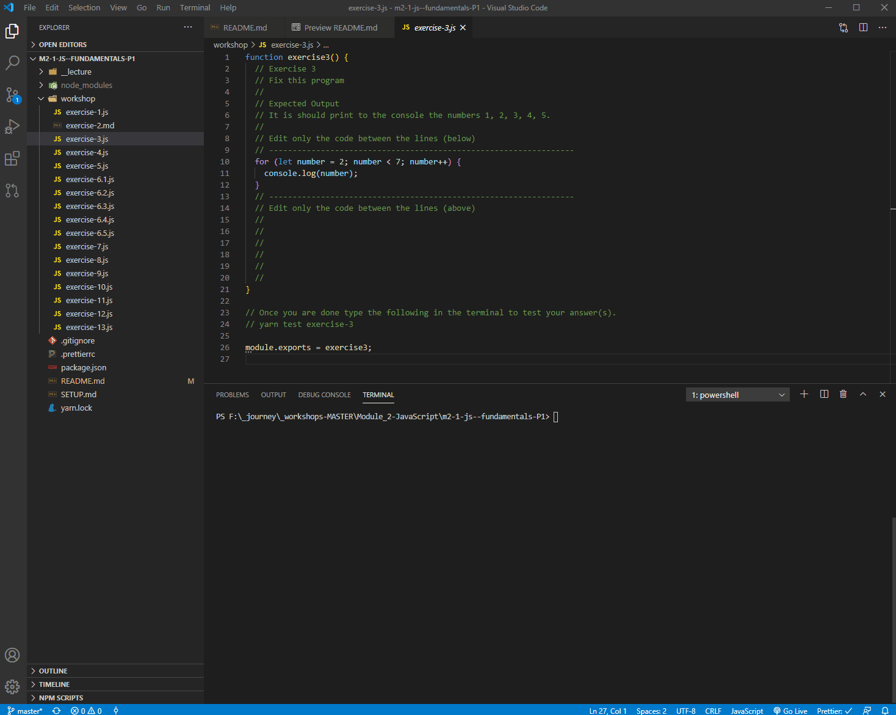

# JavaScript Fundamentals - Part 1

Today we will be learning the fundamentals of JavaScript!

---

## 🦊 Pre-lecture

⏲️ _Estimated time required: 30 minutes to 1 hour._

1. Read all of the `.md` files in `0-pre-lecture`. It covers the initial fundamental concepts that we will be starting with during the lecture.
2. There are also some exercises that you should complete.

> 💡 If you are in VS Code, you can right-click on any markdown file and select "Open Preview" to view a more "readable" version of it.

---

## 🦉 Lecture

[google_slides.pdf](1-lecture/js_fun_p1.pdf)

---

## Workshop Setup

Before starting the workshop, please run the following in the terminal. It will install all of the required dependencies. (More on that later.)

Type `ctrl`+ `j` to open the terminal inside of VS Code.

```bash
yarn install
```

In order to more easily evaluate your answers, you will need a `node` environment. VS Code provides us with a terminal, and in the terminal we can evaluate js files with Node.

It really **NOT** recommended that you use the browser console.

> 💡 You can toggle the terminal window in VS Code with the following keyboard shortcut:
>
> - `[ctrl + j]` on Windows
> - `[cmd + j]` on Mac

This will open an instance of the terminal (Mac) or the PowerShell (Win).

## Type JS directly into the Node Env.

- Type the following in the terminal, and hit `enter`.

```bash
node 2-workshop/exercise-3.js
```

This will execute all of the code in the `exercise-3.js` file.

---

## Testing

This workshop can "test" your code and validate your answers. (We will talk more about this later.)

If you want to test your code/validate your answer, you can type `yarn test <FILE_NAME>` in the terminal (without the `.js`).



In this workshop, there will be a reminder to do this at the end of every exercise file.

---

## ⚡ Exercises

### Exercise 2

_This a series of code jumble questions. Answer directly in the [exercise-2.md](__2-workshop/exercise-2.md) file._

There is no automated testing for this file.

---

For exercises 3 to 13, you should only write the needed code to solve the exercise between the provided lines.

```js
// Write code between the lines (below)
// -----------------------------------------------------------------
// WRITE YOUR CODE HERE <--

// -----------------------------------------------------------------
// Write code between the lines (above)
```

---

### Exercise 3 - Fix this program

It is should print to the console the numbers 1, 2, 3, 4, 5.

- Open [exercise-3.js](2-workshop/exercise-3.js) file.

### Exercise 4 - Fix this program

It should output the squares of all numbers between 0 and 12

Open [exercise-4.js](2-workshop/exercise-4.js) file.

### Exercise 5 - Fix this program

It should output all of the odd numbers between 1 and 25 (including 1 and 25).

Open [exercise-5.js](2-workshop/exercise-5.js) file.

### Exercise 6

This exercise contains 5 questions (6.1 to 6.5) that all start with _Write a loop that ..._

- Open [exercise-6.1.js](2-workshop/exercise-6.1.js) file.
- Open [exercise-6.2.js](2-workshop/exercise-6.2.js) file.
- Open [exercise-6.3.js](2-workshop/exercise-6.3.js) file.
- Open [exercise-6.4.js](2-workshop/exercise-6.4.js) file.
- Open [exercise-6.5.js](2-workshop/exercise-6.5.js) file.

---

<center>🟡 - Minimally complete workshop (75%) - 🟡</center>

---

### Exercise 7

Life in the army is regimented!

Write a loop that will output every hour of the day (0 to 23) and determine whether it is time to sleep, eat or train.

- Open [exercise-7.js](2-workshop/exercise-7.js) file.

### Exercise 8

Write a program that will output the sum of all of the multiples of four between 0 and 5000

- Open [exercise-8.js](2-workshop/exercise-8.js) file.

### Exercise 9

Write a program that goes through every number between 1 and 100, and follows the following rules:

- If the number is divisible by 3 (eg. 6), print "Fizz".
- If the number is divisible by 5 (eg. 10), print "Buzz".
- If the number is divisible by 3 AND 5 (eg. 15), print "FizzBuzz".
- For all other numbers, print the number itself.

- Open [exercise-9.js](2-workshop/exercise-9.js) file.

### Exercise 10

Write a loop that makes seven calls to console.log to output the following triangle:

```
#
##
###
####
#####
######
#######
```

- Open [exercise-10.js](2-workshop/exercise-10.js) file.

---

<center>🟢 - Complete workshop (100%) - 🟢</center>

---

### Exercise 11 - Stretch

Write a program that creates a string that represents an 8×8 grid, using newline characters to separate lines.

- Open [exercise-11.js](2-workshop/exercise-11.js) file.

### Exercise 12 - Stretch

Write a program that generates a list of all prime numbers between 1 and 200.

- Open [exercise-12.js](2-workshop/exercise-12.js) file.

### Exercise 13 - Stretch

Write a program which calculates the 50th number in the fibonacci sequence.

- Open [exercise-13.js](2-workshop/exercise-13.js) file.
