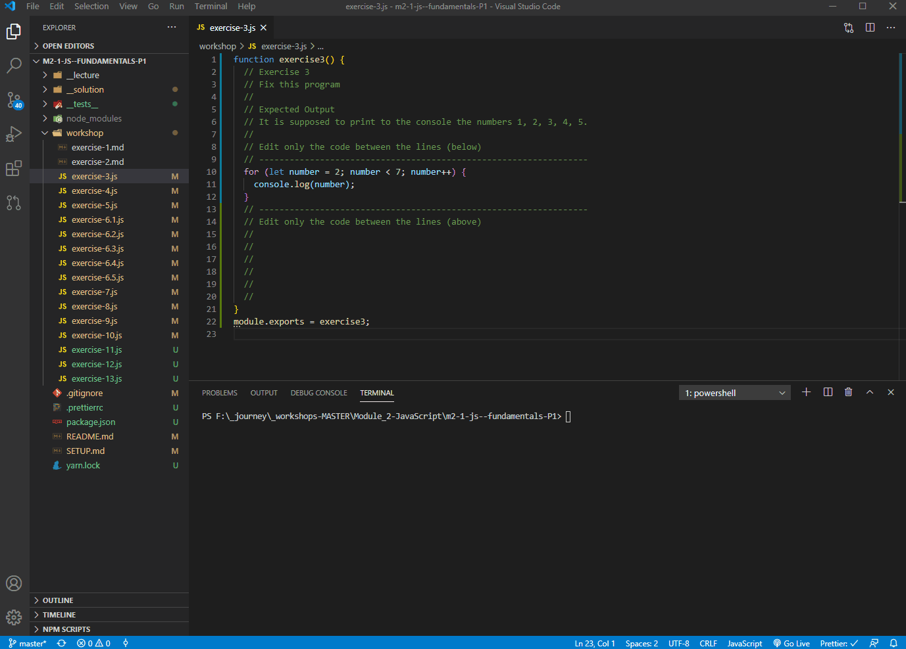

# Setup

Before starting the workshop, please run the following in the terminal. It will install all of the required dependencies. (More on that later.)

```bash
yarn install
```

In order to more easily evaluate your answers, you will need a `node` environment. We could use the browser, as I did during the lecture, but it would be easier to manage if there was a way to do this in VS Code. There is! 🤯

You can toggle the terminal window in VS Code with the following keyboard shortcut:

- `[ctrl + j]` on Windows
- `[cmd + j]` on Mac

This will open an instance of the terminal (Mac) or the PowerShell (Win).

There are 2 ways to evaluate your JS using Node:

## Type JS directly into the Node Env.

- Type `node` in the terminal, and hit `enter`.

This will turn that terminal into a Node environment for you to play with.

You can type JavaScript in the same way I did while using the web browser console.

You can also copy/paste your code from your file into the node environment.

## Exit the Node Environment

To exit/quit Node and get back to the terminal, do `[ctrl + c]` twice.


